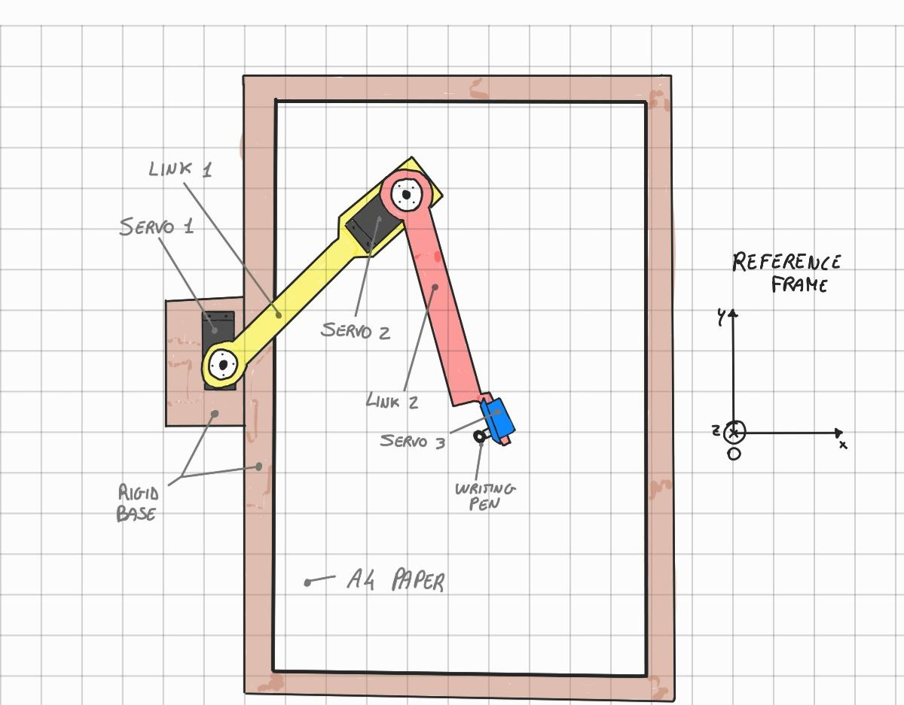
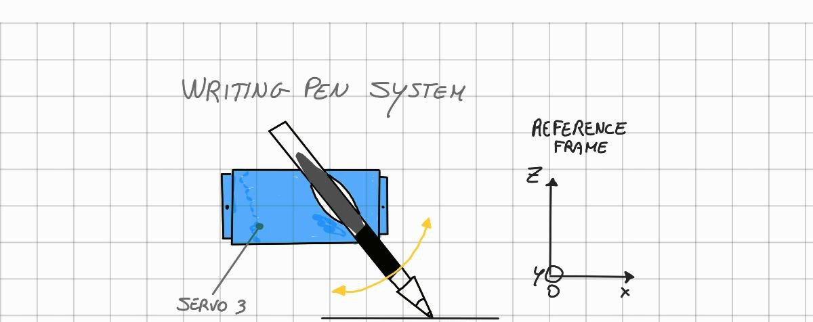

## 2D pen plotter manipulator
#### Index
* Overview     (TODO: add link to the sections)
* Structure

### Overview
The main focus of this project is to obtain a printed drawing from a digital image.
The user can load every image he wants and then the mobile-app processes it in order to execute 
the vectoralization and the generation of a gcode-like text. The manipulator is the executor of the drawing. It's not the same old structur of the 3D printer:
the structure will not be a cartesian structur, insted it will be an human-arm-like structure. 
So, after the image processing, it will be avaible a text file containg the positions that the manipulator must follow in order to recreate the drawing.
An MSP will aknowledge these positions and it will calculate the motors angle.

### Structure
The structure for the 2D pen plotter needs 2 links: one connects the first servo with the second, the second one connect the second servo with the third.
It's better to define some reference frames:
* frame 0: it's the absolute frame, the same frame of the paper;
* frame 1: it's the frame united to the first link. The x-axis is parallel to the axis of the link and the origin of the frame 1 coincides with the servo 1 pin.
* frame 2: it's the same as the frame 1, but relative to the second link and the second motor.
The final result is an human-arm-lik manipulator whose moving terminal can draw along the points expressed in the file.

The next image will clarify this notation:

The third servo is used to lift and low the pen attacched to it. This movement 
