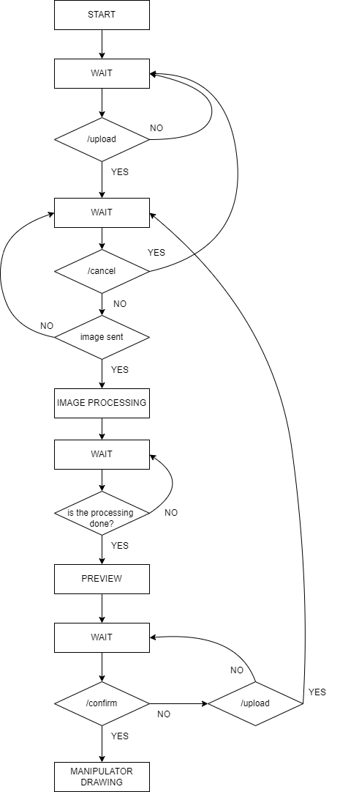

<!-- LOGO -->
 

    

<h3 align = "center">Embedded 2D SCARA-Model Pen Plotter</h3>

  

    A Computer-Vision-based IoT robotic arm with pen plotting functionalities
     
    <a href="https://www.youtube.com/watch?v=2bIokQEKmMY"><strong>Watch the demo »</strong></a>
     
     
    <h6>
    <a href="https://github.com/AlessiaRinaldi">Alessia Rinaldi</a>
    ·
    <a href="https://github.com/TianShi14">Angelo Nutu</a>
    ·
    <a href="https://github.com/alterlleo">Leonardo Pasquato</a>
    </h6>
  

<!-- TABLE OF CONTENTS -->

  
Table of Contents

  <ol>
    <li><a href="#overview">Overview</a></li>
    <li>
      <a href="#about-the-project">About The Project</a>
      <ul>
        <li><a href="#structure">Structure</a></li>
        <li><a href="#telegram-bot">Telegram Bot</a></li>
      </ul>
    </li>
    <li><a href="#roadmap">Roadmap</a></li>
    <li><a href="working-organization">Working Organization</a></li>
  </ol>

<!-- Overview -->
## Overview

This project revolves around transforming digital images into computer-crafted printed drawings. 

In contrast to the conventional Cartesian structure commonly found in 3D printers, our apparatus is fashioned in the likeness of a human arm, introducing a distinctive approach to the process.

Users are prompted to effortlessly upload their desired images to our <a href = "https://web.telegram.org/k/#@pen_plotter_bot">Telegram bot</a>, which proceeds to carry out a vectorization process, resulting in a comprehensive `JSON` file containing vectors.
Following the image vectorization process, the `JSON` document will detail the exact positions determined to be followed by the manipulator. This document will be available in the Raspberry pi Zero memory and a serial communication between the `Raspberry` and the `MSP432` will enable the line-to-line interpretation of the file by the second one. Then the `MSP432` will compute the motor angles starting by the positions read and will actuate them to carry out the movement

<!--Following the image vectorization process, a text document will detail the exact positions determined to be followed by the manipulator, which, once interpreted by the `MSP432 microcontroller`, will be computed into motor angles necessary to carry out the movement.
-->

(<a href="#top"> back to top </a>)

<!-- ### Built With

* 
* 
* 

(<a href="#readme-top">back to top</a>)
 -->

<!-- ABOUT THE PROJECT -->
## About The Project

In the following sections, we'll break down the project's components.

### Structure

The structure of the 2D pen plotter comprises two links: one linking the first servo to the second, and the other connecting the second servo to the third. To establish clarity, we define the following reference frames:

- Frame 0: this represents the absolute frame, identical to the paper's frame.
- Frame 1: aligned with the first link, its x-axis parallels the link's axis, and its origin coincides with the servo 1 pin.
- Frame 2: similar to frame 1 but relative to the second link and motor. 

The outcome is a manipulator akin to a human arm, with its end-effector capable of drawing along points specified in the file aforementioned.

For visual clarification, refer to the accompanying image:

  

The third servo serves to raise and lower the attached pen:

  

### Telegram Bot

Our interface of choice for users looking to convert their chosen image into a drawing is a `Telegram bot`. Upon receiving the user's selected image, our it initiates a structured sequence of Computer Vision algorithms. It systematically begins with a grayscale conversion, followed by Canny edge detection for precise boundary identification. Subsequently, a Gaussian blur is applied for image smoothing, and a Sobel operator to enhance edge definition.

These algorithms work alongside contouring techniques shaping distinct forms and structures within the image. Line sorting is then employed to organize the details. The outcome is a meticulously processed, vectorized image prepared for submission to the microcontroller. Throughout this process, the Telegram bot provides real-time updates on the processing status, and furthermore submits the vectorized image to the user for confirmation.

We've included a visual representation of the state machine to make things clearer:

  

( <a href="#top">back to top</a> )

<!-- Working Organization -->
TODO: write as a proper english text
The entire group started to think about the main idea of the project from the beginning of the course, until the 2D pen plotter was chosen. In the next weeks there was no individual work, every decision about the project was decided from all of us. Then the works was splitted up and the first main organization decided is:
- Angelo Nutu works on the image processing and setting up the telegram bot [more](https://github.com/AlessiaRinaldi/2D-plotter-manipulator/tree/main/Vectorization-Bot/README.md)
- Alessia Rinaldi works on the serial communication between Raspberry and the MSP432 [more](https://github.com/AlessiaRinaldi/2D-plotter-manipulator/tree/main/MSP-codes);
- Leonardo Pasquato works on the 3D structure and the MSP432 attuation of the motors [more](https://github.com/AlessiaRinaldi/2D-plotter-manipulator/tree/main/MSP-codes).
All of three of us works on the telegram-bot.

<!-- ROADMAP -->
## Roadmap

- [ ] Telegram Bot
- [ ] Point-to-Point connection
    - [ ] Protocol implementation
    - [ ] Transmission 
- [ ] Motor control
    - [ ] Serial connection between microcontroller and wi-fi module
    - [ ] Math implementation
    - [ ] Motor PWM definition
- [ ] Working organization

( <a href="#top">back to top</a> )

<!-- ACKNOWLEDGMENTS -->
<!--## Acknowledgments

* 
* 
* 

(<a href="#top">back to top</a>)
 Per librerie specifiche e citazioni varie, direi formale e carino da fare ma si vede alla fine -->
